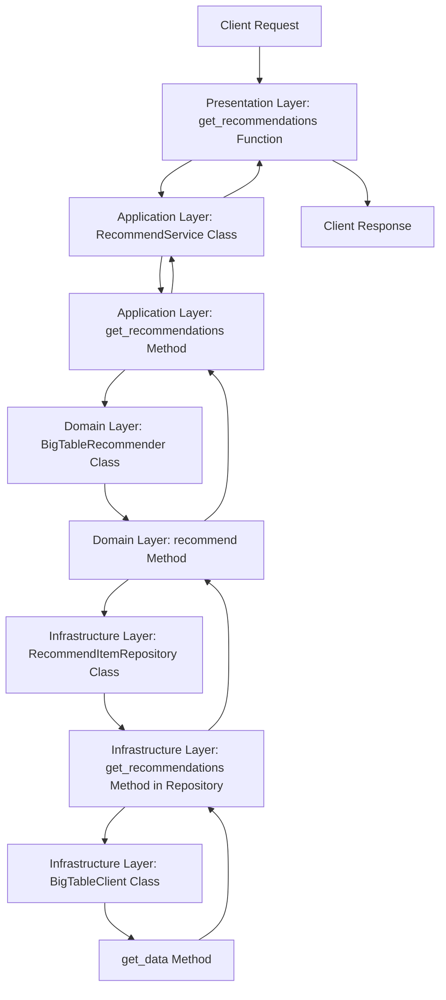

# Recommendation API README

## 概要
Recommendation APIは、ユーザーに対して推薦結果を提供するシンプルなAPIです。FastAPIを使用して構築されており、Google Cloud BigTableからデータを取得します。オニオンアーキテクチャを採用し、各層が明確に分かれています。

## セットアップ

### 必要条件
- Python 3.9
- poetry

### インストール手順

1. リポジトリをクローンします。
   - `git clone <repository_url>`
   - `cd <repository_directory>`

2. Poetryを使用して依存関係をインストールします。
   - `poetry install`

3. 必要に応じて、`app/utils/const.py`内のBigTable接続設定を編集します。

## 実行方法

### ローカル環境での実行
- `uvicorn app.presentation.main:app --reload`

### Dockerを使用した実行
1. Dockerイメージをビルドします。
   - `docker build -t recommendation-api .`

2. Dockerコンテナを起動します。
   - `docker run -p 8000:8000 recommendation-api`

## エンドポイント

### GET /recommendations
指定されたユーザーIDに対する推薦結果を取得します。

#### リクエストパラメータ
- `user_id` (str): ユーザーID

#### リクエスト例
- `curl -X 'GET' 'http://localhost:8000/recommendations?user_id=test_user' -H 'accept: application/json'`

#### レスポンス
- 200 OK: 推薦結果を含むJSONオブジェクト
- 500 Internal Server Error: 推薦結果の取得に失敗した場合

#### レスポンス例
- `{ "recommendations": ["item1", "item2", "item3"] }`

## テスト
テストは`pytest`を使用して実行します。

- `poetry run pytest`

## APIの流れ
### Mermaid記法でのフロー図

### 各ノードの説明と流れ
1. **A: Client Request**
   - クライアントがAPIにリクエストを送信します。これは、ユーザーがブラウザやアプリケーションから「推薦アイテムをください」とAPIに問い合わせることを意味します。

2. **B: Presentation Layer: get_recommendations Function**
   - **ファイル**: `app/presentation/main.py`
   - **説明**: この関数は、リクエストを受け取る最初のポイントです。ユーザーIDを受け取り、`RecommendService`を通じてビジネスロジックを呼び出します。ここで、`BigTableRecommender`を使うように設定されています。

3. **C: Application Layer: RecommendService Class**
   - **ファイル**: `app/application/recommend_service.py`
   - **説明**: `RecommendService`は、ビジネスロジックを実行するためのクラスです。`get_recommendations`メソッドを持ち、どのリコメンダーを使うかを決定します。

4. **D: Application Layer: get_recommendations Method**
   - **説明**: `RecommendService`のこのメソッドは、`BigTableRecommender`の`recommend`メソッドを呼び出します。これにより、推薦アイテムを取得するプロセスが始まります。

5. **E: Domain Layer: BigTableRecommender Class**
   - **ファイル**: `app/domain/recommenders.py`
   - **説明**: `BigTableRecommender`は、実際にBigTableからデータを取得するためのクラスです。このクラスは、どのデータを取得するかを決定します。

6. **F: Domain Layer: recommend Method**
   - **説明**: `BigTableRecommender`のこのメソッドは、`RecommendItemRepository`を使ってデータを取得します。ここで、どのユーザーにどのアイテムを推薦するかを決定します。

7. **G: Infrastructure Layer: RecommendItemRepository Class**
   - **ファイル**: `app/infrastructure/repositories/recommend_item_repository.py`
   - **説明**: `RecommendItemRepository`は、データベースからデータを取得するためのクラスです。ここでは、`BigTableClient`を使って実際のデータ取得を行います。

8. **H: Infrastructure Layer: get_recommendations Method in Repository**
   - **説明**: このメソッドは、`BigTableClient`を呼び出して、データを取得します。

9. **I: Infrastructure Layer: BigTableClient Class**
   - **ファイル**: `app/infrastructure/clients/bigtable.py`
   - **説明**: `BigTableClient`は、Google Cloud BigTableに接続し、データを取得するためのクラスです。

10. **J: Infrastructure Layer: get_data Method**
    - **説明**: `BigTableClient`のこのメソッドは、実際にBigTableからデータを取得します。ここで、ユーザーIDに基づいてデータを取得します。

11. **H: Infrastructure Layer: get_recommendations Method in Repository**
    - データ取得後、`RecommendItemRepository`に戻り、取得したデータをドメイン層に返します。

12. **F: Domain Layer: recommend Method**
    - `recommend`メソッドがデータを受け取り、アプリケーション層に返します。

13. **D: Application Layer: get_recommendations Method**
    - `RecommendService`の`get_recommendations`メソッドがデータを受け取り、プレゼンテーション層に返します。

14. **B: Presentation Layer: get_recommendations Function**
    - `get_recommendations`関数が最終的な推薦アイテムを含むレスポンスを生成します。

15. **K: Client Response**
    - クライアントにレスポンスが返されます。これにより、ユーザーは推薦アイテムを受け取ることができます。